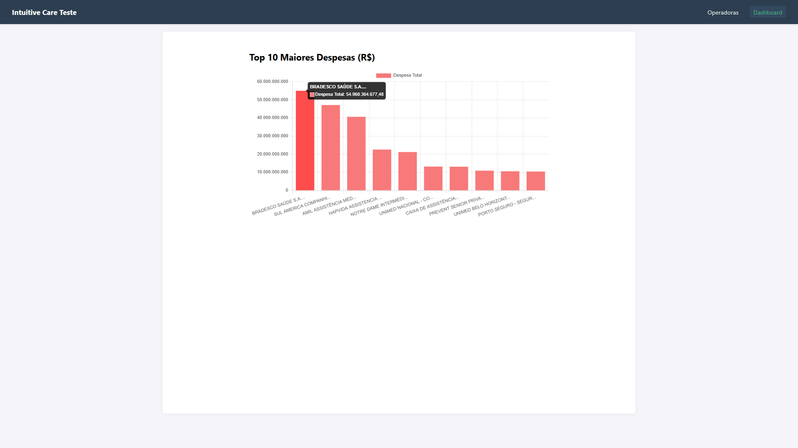
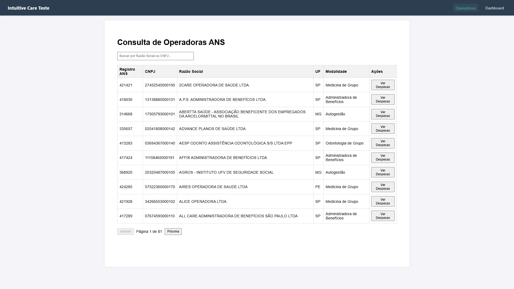
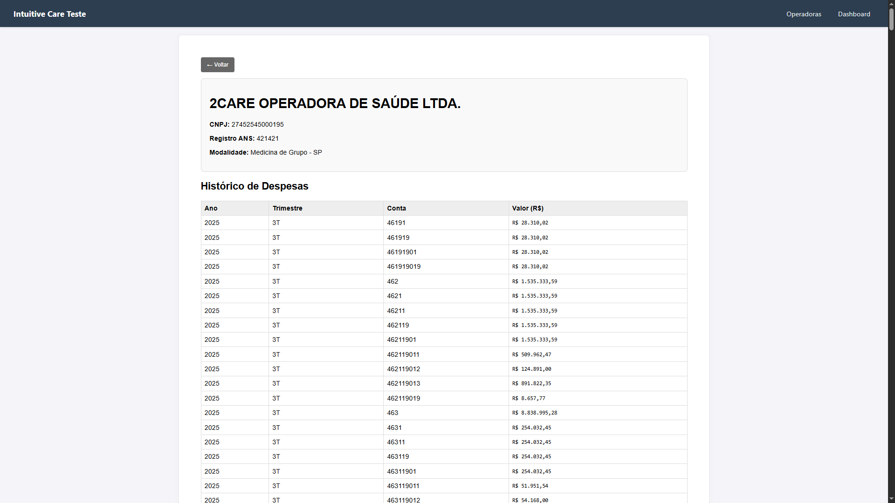

# Teste Técnico Intuitive Care - Estágio IntuitiveCare 2026



Essa solução foi desenvolvida para o processo seletivo de Estágio 2026 da Intuitve Care.
Este projeto implementa um pipeline completo de ETL (Extração, Transformação e Carga), Data Warehouse em PostgreSQL, API RESTful de alta performance e um Frontend interativo em Vue

## Mas, e Como é para Executar o Projeto?

### Vamos aos: Pré-requisitos
* **Docker & Docker Compose** (para o Banco de Dados)
* **Python 3.10+** (Para ETL e Backend)
* **Node.js 18+** (Para o Frontend)

### 1. Infraestrutura (Banco de Dados)
Suba o container do PostgreSQL com Docker (Caso seja Windows você pode utilizar o WSL, é instalado automaticamente com o Docker Desktop):
```bash
docker-compose up -d
```

### 2. Backend & ETL (Python)
Hora de criar o ambiente virtual, instalar as dependências e executar o pipeline de dados:

# Configuração do Ambiente
python -m venv venv
## Windows:
.\venv\Scripts\activate
## Linux ou Mac:
source venv/bin/activate

## Instalação dos pacotes
pip install -r requirements.txt

Execução do Pipeline ETL (faça isso de forma sequencial)
### 1- Esse script baixa os dados da ANS (Crawler resiliente a mudanças de diretório)
python etl/1_downloader.py

### 2- Esse script processa, limpa e enriquece/alimenta os CSVs (Tratamento de Encoding e Cadop)
python etl/2_processor.py

### 3- Esse script agrega dados e remove duplicidade contábil (Regra de Negócio)
python etl/3_aggregator.py

### 4- E esse script carrega os dados no Banco SQL (Bulk Insert de Alta Performance)
python etl/4_loader.py

## Mas e como inicia a API?

Utilize o comando: uvicorn backend.main:app --reload

Com isso você já pode acessar a documentação da API (Swagger): http://127.0.0.1:8000/docs

## 3. Frontend 
Em um novo terminal inicie a interface Vue.js:

cd frontend
npm install
npm run dev

Após isso é só acessar: http://localhost:5173

## Screenshots do Sistema

### Dashboard de Análise (Combo de: Vue.js + Chart.js)
Visualize as maiores despesas por operadora de forma instantanea:


### Listagem e Busca
Paginação server-side e filtros em tempo real:


### Detalhamento de Despesas
Histórico completo vindo do Data Warehouse:


# Vamos falar sobre o projeto: Arquitetura e Trade-offs (Minhas decisões técnicas)

## 1 Engenharia de Dados (ETL)
Crawler Híbrido: A estrutura do servidor FTP da ANS varia historicamente (pastas x arquivos soltos). Com isso implementei um algoritmo que detecta dinamicamente o formato do diretório, garantindo a resiliência contra as mudanças futuras no site do governo

Consistência de Dados (encoding): Dados governamentais misturam UTF-8 e Latin-1 (antigo). O processador implementa uma estratégia de fallback automatico, testando encodings para evitar corrupção de caracteres (mojibake)

Regra de Negócio (Duplicidade Contábil): As demonstrações contábeis possuem hierarquia (Contas Sintéticas somam Analíticas). Uma agregação simples duplicaria os valores, com isso foi aplicado essa resolução

Decisão: Implementei um filtro lógico que prioriza a conta totalizadora de nível superior (Conta 4) para evitar dupla contagem

Performance de Carga: Utilizei Bulk Insert (via SQLAlchemy/Postgres COPY) ao invés de inserções linha-a-linha (Que seria terrivel em tempo e desempenho). Isso reduziu o tempo de carga de 15 minutos para segundos

## 2 Banco de Dados
Modelagem Star Schema: separei os dados em dim_operadoras (Dimensão) e fato_despesas (Fato)

Justificativa: Reduz redundância de armazenamento (strings repetidas milhões de vezes) e otimiza queries analíticas

## 3 Backend & API
FastAPI vs Flask: Optei pelo FastAPI pela performance assíncrona e validação de dados nativa com Pydantic (Type Safety), tendo em garantia um código muito mais robusto e menos propenso a bugs

A Otimização de Query: A rota de estatísticas (/estatisticas) nAo realiza cálculos em tempo real. Ela consome uma tabela pré-agregada (analise_agregada) gerada durante o ETL. isso garante resposta instantânea (<50ms) independente do volume de dados

## 4 Frontend
Vue 3 + Vite: Escolha baseada em performance e modernidade (Composition API), garantindo um bundle leve e carregamento rápido para esse desafio

Paginação Server-Side: Para nao travar o navegador do cliente, a listagem de operadoras utiliza paginação real (LIMIT/OFFSET) direto no banco de dados

# Os diferenciais que foram implementados:

Testes Automatizados: Suíte de testes de integração (pytest) cobrindo rotas da API e validação de schemas. Teste e Execute com: python -m pytest

Performance: Uso de índices SQL, Bulk Inserts e Paginação

Cloud-Ready: Aplicação totalmente containerizada (Docker), pronta para deploy em Kubernetes ou ECS

Versionamento: Uso de Git seguindo padrão Conventional Commits para histórico 

Projeto desenvolvido por Geraldo Alves de Almeida Filho
